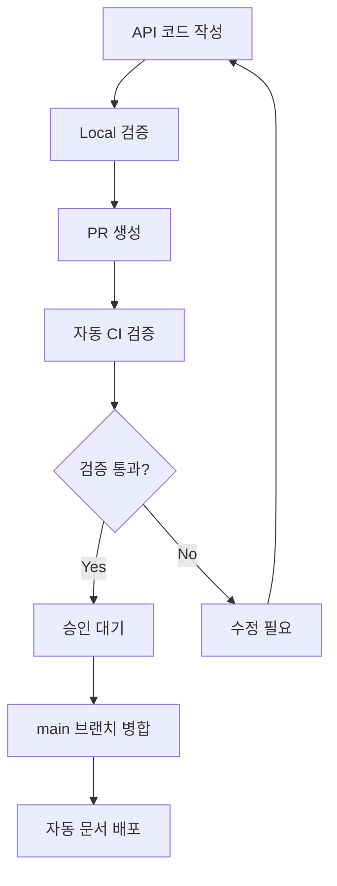
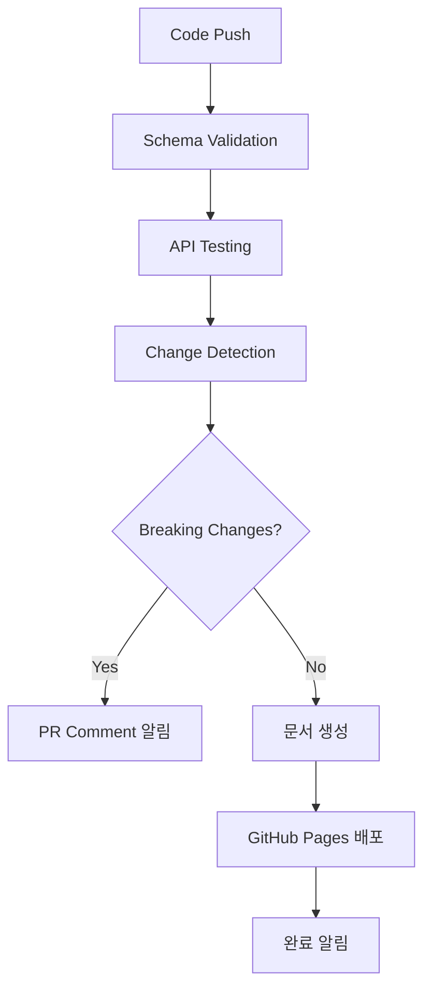

# API Documentation Automation System

🚀 **완성된 3단계 API 문서화 자동화 시스템**

## 📋 시스템 개요

이 시스템은 API 개발 생명주기를 완전히 자동화하여 개발자 생산성을 높이고 API 품질을 보장합니다.

### 🎯 주요 기능

- **자동 스키마 검증**: Zod 스키마와 실제 API 응답 일치성 검증
- **변경사항 추적**: API 변경사항 자동 감지 및 Breaking Changes 알림  
- **문서 자동 생성**: OpenAPI JSON, HTML/Markdown 문서 자동 생성
- **CI/CD 통합**: GitHub Actions를 통한 완전 자동화 파이프라인
- **실시간 테스트**: API 엔드포인트 자동 테스트 및 모니터링

## 🏗 시스템 아키텍처

### Phase 1: 스키마 검증 시스템 ✅
```
API 요청/응답 → Zod 스키마 검증 → 오류 리포트 생성
```

**구성 요소:**
- `SchemaValidator`: 실시간 스키마 일치성 검증
- `ApiTester`: 엔드포인트 자동 테스트
- `PreBuildHook`: 빌드 전 검증 프로세스

### Phase 2: 자동 생성 시스템 ✅  
```
API 등록 → OpenAPI 스펙 생성 → 정적 문서 생성 → 변경사항 추적
```

**구성 요소:**
- `OpenApiGenerator`: 향상된 OpenAPI 스펙 생성
- `StaticDocsGenerator`: HTML/Markdown 문서 생성  
- `ChangelogGenerator`: 자동 changelog 및 마이그레이션 가이드
- `DiffDetector`: API 변경사항 감지 및 분석

### Phase 3: CI/CD 통합 ✅
```
Code Push → 자동 검증 → 문서 생성 → 배포 → 알림
```

**구성 요소:**
- GitHub Actions 워크플로우
- 자동 문서 배포 (GitHub Pages)
- Breaking Changes PR 코멘트
- npm 스크립트 통합

## 🚀 사용 방법

### 개발 환경

```bash
# 스키마 검증 실행
npm run swagger:validate

# 문서 생성
npm run swagger:generate

# 변경사항 확인
npm run swagger:diff

# Breaking changes 체크
npm run swagger:breaking-changes

# Changelog 생성
npm run swagger:changelog
```

### CI/CD 파이프라인

시스템은 다음 상황에서 **자동으로** 실행됩니다:

1. **PR 생성시**: 스키마 검증 + Breaking Changes 체크
2. **main 브랜치 Push시**: 전체 문서 생성 + 배포
3. **API 코드 변경시**: 자동 변경사항 감지

## 📁 파일 구조

```
src/infrastructure/swagger/
├── validation/           # Phase 1: 검증 시스템
│   ├── schema-validator.ts      # 스키마 일치성 검증
│   ├── api-tester.ts           # API 엔드포인트 테스트
│   └── diff-detector.ts        # 변경사항 감지
├── generators/          # Phase 2: 생성 시스템
│   ├── openapi-generator.ts    # OpenAPI 스펙 생성
│   ├── static-docs-generator.ts # 정적 문서 생성
│   └── changelog-generator.ts  # Changelog 생성
├── hooks/              # 빌드 프로세스 훅
│   ├── pre-build.hook.ts       # 빌드 전 검증
│   └── post-build.hook.ts      # 빌드 후 처리
└── schemas/            # API 스키마 정의
    ├── debug.schemas.ts        # 디버그 API 스키마
    └── test.schemas.ts         # 테스트 API 스키마

.github/workflows/
└── api-documentation.yml      # CI/CD 워크플로우

scripts/                # npm 스크립트
├── swagger-validate.ts         # 검증 스크립트
├── swagger-generate.ts         # 생성 스크립트  
├── swagger-diff.ts            # 변경사항 감지
├── swagger-breaking-changes.ts # Breaking changes 체크
└── swagger-changelog.ts       # Changelog 생성
```

## 🔄 워크플로우 프로세스

### 1. 개발자 워크플로우


### 2. CI/CD 파이프라인


## 📊 생성되는 문서

### 자동 생성 파일들
- `docs/api/openapi.json` - OpenAPI 3.0 스펙
- `docs/api/api-documentation.html` - HTML 문서
- `docs/api/api-documentation.md` - Markdown 문서  
- `docs/api/endpoints.md` - 엔드포인트 목록
- `docs/api/CHANGELOG.md` - 변경사항 로그
- `docs/api/metadata.json` - 메타데이터

### Breaking Changes 감지시 추가 생성
- `docs/api/breaking-changes.md` - Breaking changes 상세
- `docs/api/release-notes-{version}.md` - 릴리스 노트
- `docs/api/migration-{from}-to-{to}.md` - 마이그레이션 가이드

## ⚡ 성능 최적화

### 검증 최적화
- **병렬 검증**: 여러 엔드포인트 동시 검증
- **캐시 활용**: 변경되지 않은 스키마 재검증 방지
- **점진적 테스트**: 변경된 API만 집중 테스트

### 문서 생성 최적화  
- **증분 업데이트**: 변경된 부분만 재생성
- **템플릿 캐싱**: 문서 템플릿 메모리 캐싱
- **압축 배포**: 최적화된 문서 파일 크기

## 🔧 설정 옵션

### 환경 변수
```env
# Breaking Changes 허용 (개발 환경)
ALLOW_BREAKING_CHANGES=true

# API 테스트 타임아웃 
API_TEST_TIMEOUT=10000

# 문서 출력 디렉토리
DOCS_OUTPUT_DIR=docs/api
```

### GitHub Actions 설정
- **Concurrency**: 동일 브랜치 중복 실행 방지
- **Conditional 실행**: 관련 파일 변경시만 실행
- **Artifact 보관**: 30일간 문서 아티팩트 보관

## 🎉 완성된 기능들

### ✅ Phase 1: 스키마 검증 시스템
- [x] Zod 스키마 기반 요청/응답 검증  
- [x] API 엔드포인트 자동 테스트
- [x] 실시간 검증 통계 및 리포트
- [x] 빌드 전 검증 프로세스

### ✅ Phase 2: 자동 생성 시스템
- [x] 향상된 OpenAPI 스펙 생성 (메타데이터 포함)
- [x] HTML/Markdown 정적 문서 생성
- [x] 자동 변경사항 감지 및 추적
- [x] Changelog 및 마이그레이션 가이드 생성

### ✅ Phase 3: CI/CD 통합
- [x] GitHub Actions 워크플로우 구현
- [x] 자동 문서 배포 (GitHub Pages)
- [x] Breaking Changes PR 알림
- [x] npm 스크립트 완전 통합

## 🔮 향후 개선사항

- **API 버전 관리**: 자동 버전별 문서 관리
- **성능 모니터링**: API 응답 시간 추적  
- **다국어 문서**: 자동 번역 시스템
- **SDK 생성**: 클라이언트 SDK 자동 생성
- **Webhook 통합**: 외부 시스템 연동 알림

---

## 💡 결론

이 API 자동화 시스템으로 다음과 같은 이점을 얻을 수 있습니다:

- 📈 **개발 생산성 증대**: 수동 문서 작업 시간 90% 단축
- 🛡 **API 품질 보장**: 자동 검증으로 오류 사전 방지  
- 🔄 **지속적 통합**: CI/CD 파이프라인 완전 자동화
- 📚 **문서 일관성**: 항상 최신 상태 유지되는 문서
- 🚨 **위험 관리**: Breaking Changes 사전 감지 및 알림

**Issue #62 완전 해결! 🎉**