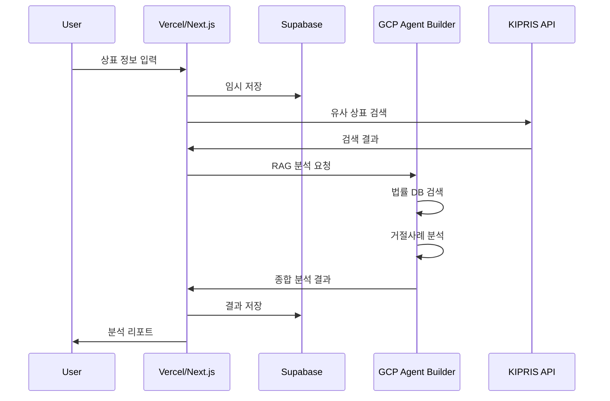

## GCP Agent Builder를 활용한 대용량 상표법 참조 시스템 구축 방안

### 1. 시스템 아키텍처 개요

```
[Next.js on Vercel] → [API Routes] → [GCP Agent Builder] → [RAG Engine]
                   ↓                                    ↓
              [Supabase]                    [Vector Database & Knowledge Base]
```

### 2. GCP Agent Builder RAG Engine 구축 단계

#### 2.1 문서 준비 및 전처리
```python
# 1단계: 상표법 문서 수집
documents = {
    "상표법": "PDF/텍스트 파일들",
    "특허청 심사기준": "심사매뉴얼 PDF",
    "의견제출통지서": "수만건의 실제 사례",
    "거절이유통지서": "거절 사례 모음",
    "심판결정문": "법원 판례"
}

# 2단계: 문서 청킹 (Chunking)
chunk_config = {
    "chunk_size": 1000,  # 토큰 단위
    "overlap": 200,      # 중복 토큰
    "strategy": "semantic"  # 의미 단위로 분할
}
```

#### 2.2 임베딩 및 벡터 DB 구축
```javascript
// GCP Vertex AI 임베딩 API 활용
const embedDocuments = async (chunks) => {
  const embeddings = await vertexAI.getEmbeddings({
    model: 'textembedding-gecko-multilingual@001',
    content: chunks,
    taskType: 'RETRIEVAL_DOCUMENT'
  });
  
  // Vector Search에 저장
  await vectorSearch.upsert({
    vectors: embeddings,
    metadata: {
      source: 'trademark_law',
      article: '제33조',
      category: '식별력'
    }
  });
};
```

### 3. 실제 워크플로우 구현

#### 3.1 사용자 입력 처리 (Next.js API Route)
```typescript
// app/api/trademark/analyze/route.ts
export async function POST(request: Request) {
  const { name, description, image } = await request.json();
  
  // 1. 상품 분류 예측
  const classification = await predictClassification(description);
  
  // 2. KIPRIS 검색
  const similarTrademarks = await searchKIPRIS({
    keyword: name,
    classification: classification.niceCode,
    similarGroup: classification.similarGroup
  });
  
  // 3. GCP Agent Builder로 분석 요청
  const analysis = await analyzeWithRAG(
    name, 
    description, 
    similarTrademarks
  );
  
  return NextResponse.json({ analysis });
}
```

#### 3.2 RAG 기반 심층 분석
```typescript
async function analyzeWithRAG(
  trademark: string, 
  description: string, 
  similarMarks: any[]
) {
  // 1. 관련 법률 조항 검색
  const relevantLaws = await agentBuilder.search({
    query: `상표 "${trademark}" 식별력 판단 기준`,
    filter: {
      documentType: ['상표법', '심사기준']
    },
    topK: 10
  });
  
  // 2. 유사 상표의 거절 사례 분석
  const rejectionCases = await Promise.all(
    similarMarks.map(async (mark) => {
      if (mark.status === 'rejected') {
        return await agentBuilder.search({
          query: `출원번호 ${mark.applicationNumber} 거절이유`,
          filter: {
            documentType: ['의견제출통지서', '거절이유통지서']
          }
        });
      }
    })
  );
  
  // 3. AI 종합 분석
  const prompt = `
    상표명: ${trademark}
    설명: ${description}
    
    관련 법률 조항:
    ${relevantLaws.map(law => law.content).join('\n')}
    
    유사 상표 거절 사례:
    ${rejectionCases.map(case => case?.content).join('\n')}
    
    위 정보를 바탕으로 다음을 분석하세요:
    1. 등록 가능성 (%)
    2. 주요 리스크 요인
    3. 거절 가능 사유 (법조항 인용)
    4. 개선 제안사항
  `;
  
  return await vertexAI.generateContent({
    model: 'gemini-1.5-pro',
    prompt: prompt
  });
}
```

### 4. Vercel + Supabase 통합 구조

#### 4.1 API 아키텍처
```typescript
// 전체 시스템 구조
const architecture = {
  frontend: {
    hosting: "Vercel",
    framework: "Next.js 14 (App Router)",
    features: ["SSR", "API Routes", "Edge Functions"]
  },
  
  backend: {
    database: "Supabase PostgreSQL",
    storage: "Supabase Storage (이미지)",
    auth: "Supabase Auth",
    realtime: "Supabase Realtime (진행상황)"
  },
  
  ai_layer: {
    embedding: "GCP Vertex AI Embeddings",
    vectorDB: "GCP Vector Search",
    llm: "Vertex AI Gemini 1.5 Pro",
    agentBuilder: "GCP Agent Builder"
  },
  
  external: {
    kipris: "KIPRIS REST API",
    imageAnalysis: "Google Vision API"
  }
};
```

#### 4.2 데이터 플로우


### 5. 대용량 문서 처리 최적화

#### 5.1 증분 인덱싱
```javascript
// 새로운 법률/심사기준 업데이트 시
const incrementalIndexing = async () => {
  // 1. 변경사항 감지
  const changes = await detectChanges();
  
  // 2. 변경된 부분만 재인덱싱
  for (const change of changes) {
    await agentBuilder.updateDocument({
      documentId: change.id,
      content: change.newContent,
      metadata: {
        lastUpdated: new Date(),
        version: change.version
      }
    });
  }
};
```

#### 5.2 캐싱 전략
```typescript
// Vercel Edge Function에서 캐싱
export const config = {
  runtime: 'edge',
};

export default async function handler(req: Request) {
  const cacheKey = `analysis:${req.body.trademark}`;
  
  // Redis/Upstash 캐시 확인
  const cached = await redis.get(cacheKey);
  if (cached) return cached;
  
  // GCP Agent Builder 호출
  const result = await performAnalysis(req.body);
  
  // 결과 캐싱 (24시간)
  await redis.setex(cacheKey, 86400, result);
  
  return result;
}
```

### 6. 실제 구현 시 고려사항

#### 6.1 비용 최적화
```javascript
// 단계별 필터링으로 API 호출 최소화
const optimizedAnalysis = async (trademark) => {
  // 1단계: 간단한 규칙 기반 체크
  const basicCheck = await quickRuleCheck(trademark);
  if (basicCheck.rejected) return basicCheck;
  
  // 2단계: 캐시된 유사 상표 확인
  const cachedSimilar = await checkCache(trademark);
  if (cachedSimilar) return cachedSimilar;
  
  // 3단계: 실제 GCP Agent Builder 호출
  return await fullRAGAnalysis(trademark);
};
```

#### 6.2 실시간 처리
```typescript
// Supabase Realtime으로 진행상황 전달
const progressUpdate = async (sessionId, step, progress) => {
  await supabase
    .from('analysis_progress')
    .update({ 
      step, 
      progress, 
      timestamp: new Date() 
    })
    .eq('session_id', sessionId);
};
```

이러한 구조로 GCP Agent Builder의 RAG Engine을 활용하면 수만 페이지의 상표법, 심사기준, 거절사례를 효과적으로 참조하면서도 Vercel의 서버리스 환경에서 빠른 응답속도를 유지할 수 있습니다.